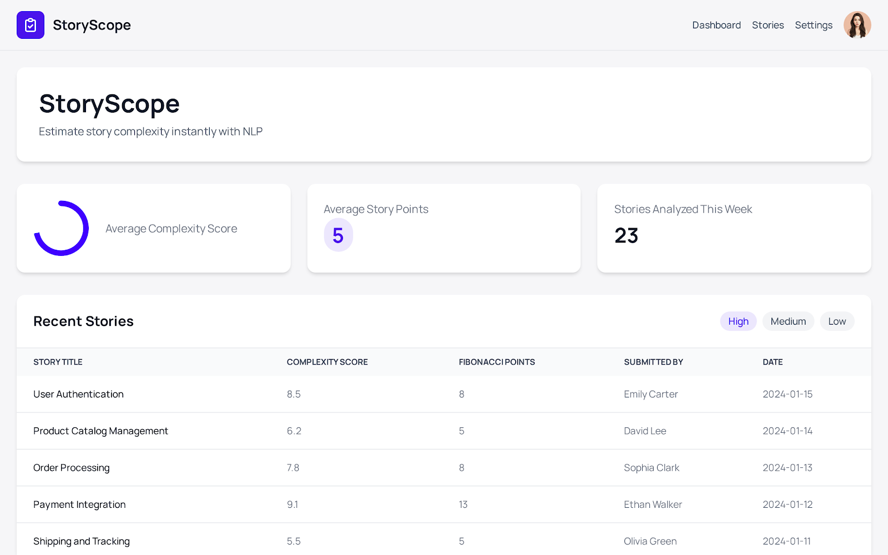
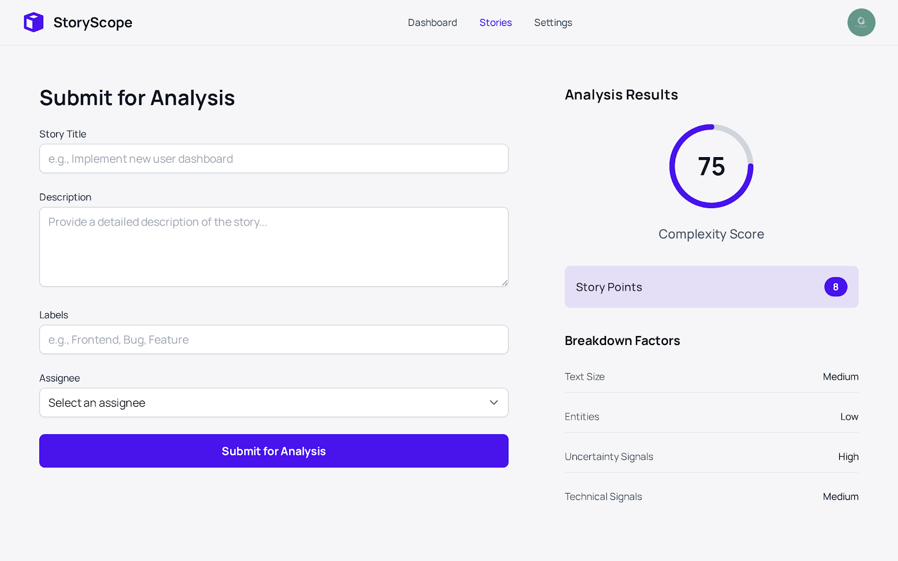
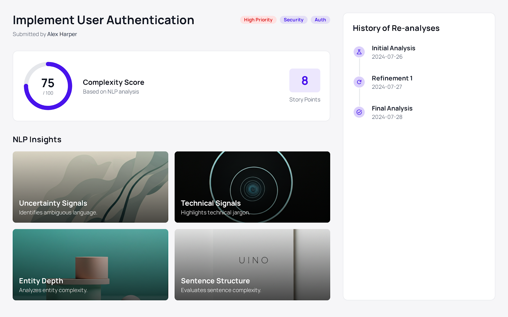

# 🧠 StoryScope

> NLP-driven Story Complexity Estimation Tool



## Overview

StoryScope uses Natural Language Processing to analyze user stories and estimate their complexity, streamlining backlog grooming and planning poker sessions.

## 🌟 Key Features

- **Smart Estimation**: NLP-powered complexity analysis
- **Fibonacci Points**: Automated story point conversion
- **Multi-factor Analysis**:
  - Text structure evaluation
  - Technical complexity detection
  - Integration depth assessment
  - Uncertainty factor analysis
- **Historical Tracking**: Store and compare estimations

## 🏗️ Tech Stack

- **Frontend**: React + TypeScript + Tailwind CSS
- **Backend**: Node.js + Express
- **NLP Engine**: Python + FastAPI + spaCy
- **Database**: PostgreSQL
- **Cache**: Redis
- **Deployment**: Railway.app

## 📸 Screenshots

| Dashboard | Story Submission | Analysis View |
|-----------|-----------------|---------------|
|  |  |  |

## 🚀 Quick Start

### Prerequisites

- Node.js ≥ 18.0.0
- Python 3.11+
- Docker Desktop
- Git

### Installation

```bash
# Clone repository
git clone https://github.com/vasistasandeep/StoryScope.git
cd StoryScope

# Install API dependencies
cd apps/api
npm install

# Install Web dependencies
cd ../web
npm install

# Setup NLP service
cd ../nlp
python -m venv .venv
.venv\Scripts\activate
pip install -r requirements.txt
python -m spacy download en_core_web_sm
```

### Development

```bash
# Start all services
docker-compose up --build

# Or start individually:
cd apps/api && npm run dev
cd apps/web && npm run dev
cd apps/nlp && uvicorn main:app --reload
```

## 📊 API Reference

### Story Estimation
```http
POST /estimate
Content-Type: application/json

{
  "summary": "Implement OAuth login",
  "description": "Add Google OAuth integration",
  "labels": "auth,security"
}
```

### Get Stories
```http
GET /stories
Authorization: Bearer <token>
```

## 🎯 Scoring Model

- **Text Analysis**: Token count with logarithmic scaling
- **Integration Depth**: Named entity recognition
- **Technical Complexity**: Keyword analysis
- **Uncertainty Factor**: Ambiguity detection
- **Label Impact**: Tag-based adjustments

## 🚢 Deployment

```bash
# Railway deployment
railway up

# Docker deployment
docker-compose -f docker-compose.prod.yml up --build
```

## 📝 Contributing

1. Fork the repository
2. Create your feature branch (`git checkout -b feature/amazing-feature`)
3. Commit changes (`git commit -m 'Add amazing feature'`)
4. Push to branch (`git push origin feature/amazing-feature`)
5. Open a Pull Request

## 📄 License

Distributed under the MIT License. See `LICENSE` for more information.

## 👤 Contact

Vasista Sandeep - [@vasistasandeep](https://github.com/vasistasandeep)

Project Link: [https://github.com/vasistasandeep/StoryScope](https://github.com/vasistasandeep/StoryScope)
